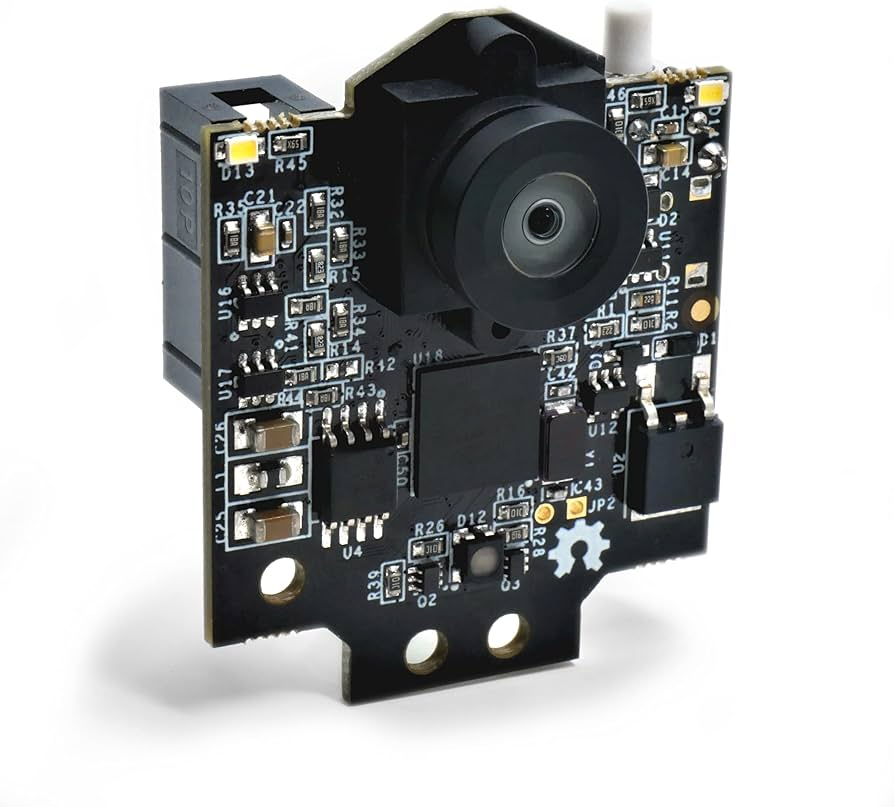
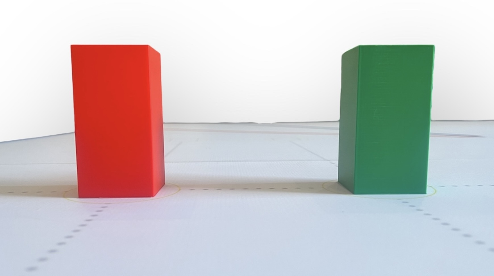

# Mobility management

**Selection and Implementation of the Ackermann Chassis for Our Robotic Vehicle**

The decision to use an open Ackermann chassis for our vehicle was driven by several key factors related to functionality, space optimization, and modularity. The Ackermann steering geometry was chosen specifically because it provides improved turning efficiency and stability compared to simpler differential steering systems, making it ideal for precise navigation and maneuverability in our application. This design ensures that the inner and outer wheels follow different turning radii, minimizing tire scrub and improving overall control—a critical advantage for a vehicle carrying multiple electronic components.

**Structural Design and Platform Configuration**

The implementation of our chassis required two distinct platforms due to spatial constraints and component organization needs. A single platform would have made the vehicle excessively long, violating the size limitations set for our project.

***Primary Platform (Pre-fabricated Chassis Base):***

This platform came as part of the commercially available Ackermann chassis kit and serves as the structural foundation. It houses:
-The steering servo motor, which controls the front wheels via the Ackermann linkage.
-The JGB37-520 drive motor, mounted to power the rear wheels, providing sufficient torque and speed for movement.
-The Nihewo battery pack, positioned for optimal weight distribution.
-Additional 3D-printed brackets and supports designed by our team to secure components effectively.

***Secondary Platform (Custom 3D-Printed Add-On):***

To accommodate the remaining electronics without overextending the chassis length, we designed and fabricated a second platform that attaches to the primary structure using four metal support pillars (included in the original chassis kit). This elevated platform contains:
-The Arduino Uno (with motor shield) acting as the central control unit.
-An H-Bridge module for bidirectional motor control.
-A Buck converter module to regulate voltage for sensitive components.
-Two ultrasonic sensors for obstacle detection.
-A PixyCam mounted on a custom 3D-printed stand, enabling vision-based navigation.

***Advantages of the Dual-Platform Approach***

The design of the system prioritizes both ease of use and optimal performance through its modular and accessible structure. By separating mechanical and electronic components onto different platforms, maintenance and debugging processes are significantly streamlined, allowing for quicker identification and resolution of issues. This stacked configuration also greatly benefits weight distribution, as the lower platform houses heavier elements like motors and batteries, thereby lowering the center of gravity and enhancing overall stability. Furthermore, the upper platform is intentionally designed with expandability in mind, providing ample space for future integrations such as additional sensors or wireless communication modules. This thoughtful arrangement ensures that the system not only complies with size limitations but also maximizes its functional capabilities within those constraints.

***Why Ackermann Steering?***

The team opted for an Ackermann steering mechanism over simpler designs like skid-steer due to its inherent advantages in vehicle dynamics. Ackermann steering significantly reduces lateral tire slippage during turns, leading to improved energy conservation and enhanced traction. This sophisticated geometry also ensures predictable handling, which is crucial for precise algorithmic control in tasks like path planning. Furthermore, the design offers greater scalability, allowing for adaptation to higher speeds or larger vehicle sizes without compromising stability. However, integrating this more complex system presented its own set of challenges. Component interference was a key concern, as the servo's movement necessitated careful placement to avoid collisions with the upper platform. This was successfully addressed by adjusting pillar heights and optimizing the servo's mounting angle. Additionally, vibration damping was essential, and the 3D-printed platform was reinforced with ribbing to prevent flexing during operation. Finally, meticulous wiring management was implemented, with cables routed through the pillars to minimize tangling and mitigate potential electromagnetic interference, ensuring reliable performance.

By leveraging the Ackermann chassis’s mechanical advantages and augmenting it with a custom 3D-printed secondary platform, we achieved a compact, high-performance robotic vehicle. This design not only meets spatial and functional requirements but also provides a robust framework for future upgrades, demonstrating the synergy between off-the-shelf components and tailored engineering solutions.

# About the Engine

We selected the JGB37-520 motor for our project due to its considerable power and high-speed performance, making it an ideal choice for efficiently driving our vehicle. After evaluating several motor options, we chose this model because it provides the right balance of torque and RPM to ensure smooth and reliable movement while maintaining energy efficiency. To mount the motor securely, we designed a custom 3D-printed bracket that holds it firmly in place at the bottom of the car’s chassis. This bracket was bolted down to prevent any unwanted vibrations or misalignment during operation. The motor is equipped with a gear mechanism that meshes with another gear connected to the rear axle, effectively transferring rotational force to the wheels. This direct-drive setup ensures optimal power transmission, allowing the rear wheels to propel the vehicle forward with consistent speed and control. The implementation was carefully tested to ensure proper gear alignment and minimal friction, maximizing the motor’s efficiency and longevity. Overall, the JGB37-520 motor, combined with our mounting solution and drivetrain design, provides a robust and reliable propulsion system for our car.

We powered the system with an 11.1 V Nihewo battery. However, a buck voltage regulator was required because the battery voltage was too high for the servomotor's requirements. We specifically set the buck regulator to 7 V, as the servomotor's maximum voltage is 7.4 V. This same battery is also connected via cables to the H-bridge, which supplies power to both the Arduino board and the car's main propulsion motor. The H-bridge provides 12 V to the car's propulsion system and 5 V to the Arduino board. Consequently, the remaining accessories, the two ultrasonic sensors and the Pixycam, are connected directly to the Arduino board pins and programmed through it.

For steering, as previously mentioned, we are using a 20 kg·cm servomotor. This component was included with the Ackerman chassis we purchased. It will be connected to the Arduino to control the car's direction and to the Buck module to regulate the voltage flow.

For the main controller, we opted for an Arduino Uno board. The primary reason for this choice is its efficiency in programming the car and its accessories compared to other controllers. Additionally, the Arduino's programming language is C++, which is the language taught at our school.

# Engineering Principles:

### **Horse Power**  
Power, as a fundamental engineering principle, determines the motor's capacity to perform work over time, and the JGB37-520 motor (12V) delivers 10-15W (0.013-0.02 HP) at rated speed—an optimal range for compact robotic applications that balances performance with energy efficiency. This power output enables the motor to overcome friction, inertia, and load resistance while maintaining consistent movement, crucial for our chassis's reliable operation. The motor's power curve reveals peak efficiency at 50-70% of maximum RPM (~130 RPM no-load speed), where it achieves the best mechanical-to-electrical power ratio, ensuring smooth acceleration and sustained motion.

The 12V supply voltage plays a key role in maintaining stable power delivery, preventing voltage sag under load while keeping the motor within safe thermal limits. Although modest in absolute terms, this power rating is carefully engineered to provide sufficient thrust without excessive bulk, thanks to its optimized power density (W/kg). Power is intrinsically linked to torque and RPM—while the motor's wattage ensures continuous operation, the gear system (when considered) efficiently transmits and amplifies this power to the wheels, preventing stalling or performance drops under resistance. Without adequate power management, the system would struggle with efficiency and heat dissipation, highlighting why the JGB37-520's balanced output is critical for long-term reliability in small-scale electromechanical applications.

### **Speed**  
Speed refers to how fast the motor’s output shaft rotates, measured in revolutions per minute (RPM), and directly impacts how quickly the car moves. The JGB37-520 motor provides a high RPM, which is then adjusted by the gear ratio to balance speed and torque. A higher gear ratio (more teeth on the driven gear) increases torque but reduces speed, while a lower ratio does the opposite. In our design, the gear connection between the motor and axle ensures an optimal balance—enough speed for swift movement while maintaining sufficient torque to prevent wheel slippage. Proper speed control is crucial for stability, especially when navigating turns or uneven surfaces.  

### **Torque (Rotational Force)**  
**Torque Characteristics and System Performance of the JGB37-520 Motor**  

The JGB37-520 motor (12V version) serves as the core of our propulsion system, delivering a rated torque of 0.7 kg·cm (0.068 N·m) under normal operation—a crucial rotational force that overcomes static friction, inertia, and drivetrain resistance to enable smooth acceleration from rest. When subjected to extreme loads, its stall torque peaks at 2.5 kg·cm (0.245 N·m), providing vital overload protection against sudden resistance spikes while preventing motor stalling. This torque capability ensures the chassis maintains motion despite friction and weight, particularly important when navigating inclines or during rapid acceleration.  

While the motor's modest power output (10-15W or 0.013-0.02 HP) might seem limiting, the system compensates through intelligent mechanical optimization. The gear reduction mechanism (where a smaller motor gear drives a larger axle gear) strategically converts excess RPM into multiplied torque, prioritizing usable force over raw speed. This mechanical advantage ensures the rear wheels receive optimized thrust without overburdening the motor, while the 12V power supply maintains an efficient balance between speed potential and torque delivery. The result is a responsive drivetrain where torque effectively handles challenging conditions like inclines and acceleration, while the carefully matched power output prevents energy waste—demonstrating how precise torque management is fundamental to electromechanical system performance. Without this careful equilibrium between torque generation and power application, the system would face efficiency losses and operational challenges under load.

### **Gear Mechanics (Power Transmission & Efficiency)**  
Gears are crucial for transferring power from the motor to the wheels while optimizing efficiency. In our design, the motor’s gear meshes with a larger gear on the axle, creating a speed reduction system that trades some RPM for increased torque. This mechanical advantage ensures smoother acceleration and better load handling. Additionally, the 3D-printed mounting bracket keeps the gears properly aligned, minimizing energy loss due to friction or misalignment. Efficient gear design reduces wear, improves battery life, and ensures reliable performance. Without an effective gear system, much of the motor’s energy would be wasted, leading to poor traction and sluggish movement.  

By carefully balancing power, speed, torque, and gear mechanics, our chassis achieves an efficient and reliable drivetrain, demonstrating key engineering principles in motion control and mechanical design.
Here is our scheme of conduction and direction of our robot:

# Build

In the chart below titled "THE "READY TO GO" ELECTRICAL COMPONENTS OUR ROBOT USES ARE:", you will find:

First, the amount of that especific piece we used on the robot
Second, the name of that "ready to go" electrical piece/component

|THE "READY TO GO" ELECTRICAL COMPONENTS OUR ROBOT USES ARE:|Photo of Each:|
|-----------------------------|---------------------|
|1x Gray 11.4V JGB37-520 Motor||
|1x Pixycam 2.1||
|2x Ultrasound sensors||
|Many Arduino cables ||
|Many Alligator Cables||
|1x Nihewo Batery 11.1V/7500mAh||
|1x Arduino Uno Board||
|1x Arduino Shield Protoboard||
|1x H-Bridge Module||
|1x Buck Module||
|1x Switch On-Off||
|1x Servo Motor 7.4V||

|OTHER MATERIALS OUR ROBOT USES ARE:|Photo of each:| 
|-----------------------------|---------------------|
|1x Yahboom DIY Smart Robot Chassis Ackerman Chassis||
|1x Second Floor Platform 3d||
|1x Carriage Axle Gear 3d| |
|1x Motor Gear||
|1x Motor Support 3d||
|1x Motor Support Stand 3d||
|1x Axis 3d||

## Why did we chose all of these previous materials?
We chose all of these previous materials, components and pieces in our robot because is what we found in our robotics laboratory in school and it is what we are being taught.

Absolutely everything (the "ready to go" electrical components and the 3d printed parts) were bought, and in case of the 3d parts designed and printed, here in our country, Venezuela, except for the pixycam and the ackerman chassis which where imported from abroad.

## Note:
Most of what we've described is integrated into our final robot. However, for our previous attempts and prototypes, we utilized largely the same materials, pieces, parts, and components. It's worth noting that since this is our second year competing, many of our prototypes are carried over from last year.

# #Models:
Now, we will talk about all the information regarding our 3D printed models, designed and printed by us.

# Our 3D printers
It is important to mention that we own a Bambú Lab P1s 3d printer, which is a fundametal part in the creation of our robot.

|Printer:|Photo:| 
|-----------------------------|---------------------|
|Lambu Labs P1s||

## Green and red obstacles
This model counts with two pieces: the first one being red and the second one being green. This pieces help us practice for the second round (obstacle challenge).
|Object|Photo of each:| 
|-----------------------------|---------------------|
|Obstacules (Red and Green)||

### (you can find the 3D model stl document in this folder)

## Gears
For the gears, we designed two models the Carriage Axle Gear and the Motor Gear, which are attached to the axis (that we also designed) and to the motor.
|Name of Gear:|Photo of each:| 
|-----------------------------|---------------------|
|Motor Gear||
|Carriage Axle Gear||

## Making Kaboom Step by Step:

|Step:|Photo of each step:| 
|-----------------------------|---------------------|
|Step 1: Upon receiving the Yahboom DIY Smart Robot Chassis Ackerman Chassis, our initial modification involved a crucial adjustment to its overall length. To ensure full compliance with the competition's dimensional regulations, we carefully measured and then precisely cut the existing chassis in half. This modification was not arbitrary; it was a deliberate engineering decision to bring the robot's footprint within the prescribed limits, which are often stringent in robotics competitions. By reducing the chassis's length, we aimed to maintain the integrity of the Ackerman steering geometry while achieving the necessary compactness for optimal performance within the confined competition area. This foundational step was essential for all subsequent assembly and integration processes.||
|Step 2: Following the chassis length adjustment, our next critical step involved the creation and integration of custom motor stands. Recognizing the need for precise and secure mounting points for our drive motors, we leveraged 3D printing technology to design and fabricate these essential components. The design process for these stands considered factors such as optimal motor alignment, stability under load, and ease of assembly. Once printed, these newly manufactured motor stands were then meticulously screwed onto the existing black stands at the rear of the chassis. This strategic placement ensures that the motors are firmly anchored, minimizing vibration and maximizing power transfer to the wheels, which is vital for both efficient movement and accurate control during the competition. This approach allowed us to customize the chassis to our exact specifications, providing a robust and tailored foundation for the robot's propulsion system.||
|Step 3: Having completed the structural modification of the chassis and prepared the motor stands, the third crucial step involved securely integrating our primary drive motor onto the main platform. This process required careful alignment of the motor with its custom-designed 3D-printed support, which we had previously screwed to the back stands. The motor and its support were then firmly attached to the main chassis platform using appropriate fasteners. This robust attachment is paramount for the robot's performance, as it ensures that the motor's power is efficiently transferred to the wheels without any loss due to instability or misalignment. The secure mounting also helps in minimizing vibrations during operation, contributing to smoother movement and more precise control, which are vital for successfully completing the competition's challenges.||
|Step 4: After securely mounting the motor to the chassis, the fourth step focused on the crucial assembly of the drive train: integrating the axis and gears with the motor and its corresponding gear. This process began by carefully fitting the main drive axis through the designated bearings on the chassis, ensuring it rotated freely and smoothly. Next, the primary drive gear was precisely attached to the motor's shaft, ensuring a snug and secure fit that would prevent slippage under load. Following this, the larger driven gears were then mounted onto the main axis, aligning them perfectly with the motor's gear. This meticulous alignment is paramount to prevent binding, reduce friction, and ensure efficient power transfer. The correct meshing of these gears is fundamental to converting the motor's rotational energy into the linear motion of the robot's wheels, dictating its speed and torque. This detailed assembly ensures a robust and efficient power transmission system, critical for the robot's mobility and performance on the competition field.||
|Step 5: Following the intricate assembly of the motor and gear system, our fifth crucial step involved the strategic placement of the Nihewo battery. To optimize the robot's stability and weight distribution, we carefully positioned the battery precisely at the geometric center of the first platform. This central location is vital for maintaining balance, especially during turns and rapid movements, preventing the robot from becoming top-heavy or prone to tipping. Furthermore, securing the battery in this location minimizes any potential interference with other components and ensures a clear pathway for wiring to the motor controller and other electronic modules. The choice of the Nihewo battery was based on its appropriate power output and capacity for our robot's operational requirements, providing the necessary energy for sustained performance throughout the competition. This deliberate placement significantly contributes to the overall stability and agility of our vehicle.||
|Step 6: With the first platform fully equipped and the battery optimally placed for stability, our sixth step involved constructing the critical second tier of our robot. This upper platform, meticulously designed and 3D-printed in-house to our precise specifications, serves as the dedicated space for our electronic components and future expansion modules. To secure it firmly above the first platform, we utilized four robust metal pillars. These pillars, which were part of the original Yahboom DIY Smart Robot Chassis Ackerman Chassis kit we acquired, provided the necessary height and structural integrity to create a stable, multi-tiered architecture. Each pillar was carefully aligned and screwed into place, connecting both platforms. This vertical expansion not only maximizes the available space within our robot's footprint but also creates a clear separation between the mechanical drive system on the lower level and the sensitive electronics on the upper level, simplifying wiring, minimizing electromagnetic interference, and facilitating easier access for debugging and maintenance.||
|Step 7: Finally, with the robot's structural foundation and power system established, our attention turned to integrating the "READY TO GO" electrical components and critical sensory input. On the second, meticulously 3D-printed platform, we strategically positioned all the necessary electronic modules, ensuring a clean and organized layout to facilitate future adjustments and prevent signal interference. This included the motor driver, microcontroller, and any other "plug-and-play" components required for immediate operation. Crucially, this stage also involved mounting the custom-designed stands for our ultrasonic sensors and the Pixy camera. The ultrasonic sensors are indispensable for providing real-time distance measurements to obstacles, allowing our robot to navigate its environment safely and effectively by detecting objects in its path. Meanwhile, the Pixy camera, a compact and powerful vision sensor, is integrated to enable advanced object recognition and tracking. This visual input is paramount for tasks such as identifying specific targets, following lines, or interpreting visual cues during the competition. The stands for these sensors were designed to ensure optimal viewing angles and stable positioning, maximizing their accuracy and effectiveness in perceiving the robot's surroundings. This comprehensive integration of electronics and sensors on the upper platform transforms the chassis from a mere frame into an intelligent, capable, and autonomous competition vehicle.||

## It's absolutely vital to clarify this point, as it underscores the true innovative spirit and engineering prowess of Team TNT. While it's true that we initially acquired a Yahboom DIY Smart Robot Chassis with Ackerman steering, it is crucial to understand that **this served merely as a foundational starting point, not a pre-assembled solution**. We fundamentally transformed over 80% of this initial chassis, effectively making it a completely unique and original creation.

Unlike "off-the-shelf" construction kits, such as those made by Lego, where components are designed for specific, pre-defined builds, our approach was one of genuine design and fabrication. We didn't simply follow instructions; we re-engineered. This involved a meticulous process of cutting, redesigning, and integrating custom 3D-printed parts that are entirely unique to KABOOM. From the custom motor stands and reinforced platforms to the precise placement of every electrical component, each modification was a deliberate engineering decision aimed at optimizing performance for the specific challenges of the WRO 2025 "Future Engineers" competition.

Our robot is a testament to hands-on problem-solving, iterative design, and the integration of diverse engineering disciplines. Every structural element and every electronic component was carefully selected, designed, or adapted to meet our specific needs, making KABOOM a truly bespoke robot. It's a product of our team's ingenuity, countless hours of design work, 3D printing, wiring, and rigorous testing – a far cry from simply assembling a kit. This deep level of customization and fabrication is what truly sets KABOOM apart as our own unique and original project.
